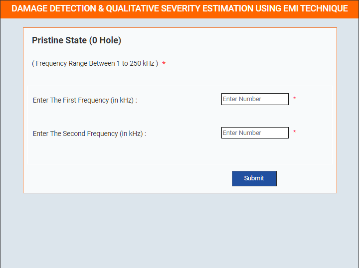

### These steps will be followed for the experiment

<!-- **PRE EXPERIMENT TASK**

1) What is electro-mechanical impedance (EMI) technique? 
2) What is conductance? What is susceptance? 
3) Why does occurrence of damage alters the conductance signatures? 
4) What is RMSD? Write an expression for it?   -->

**Preparation of specimens:**

1. Click start experiment button to start the experiment.
 

2. Select specimen type.
 

3. Enter details for Pristine.
 

 

4. Show graph for Pristine.
 
 

<!-- **POST EXPERIMENT TASK**

1) Plot and compare conductance and susceptance signature of following: 
a) Incipient Damage 
b) Moderate Damage 
c) Severe Damage 
2) Compute RMSD for all above cases.  -->
