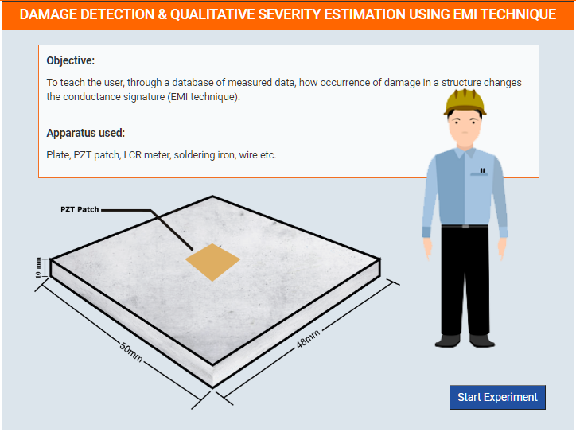
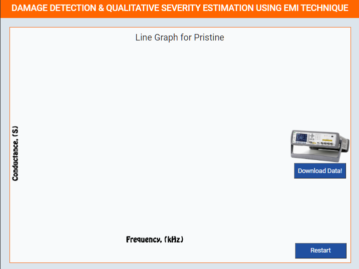

### These steps will be followed for the experiment

**PRE EXPRIMENT TASK**

1) What is electro-mechanical impedance (EMI) technique? 
2) What is conductance? What is susceptance? 
3) Why does occurrence of damage alters the conductance signatures? 
4) What is RMSD? Write an expression for it?  

**Preparation of specimens:**

1. Click Start Here button to start the experiment.
 

2. Select specimen type.
 

3. Enter details for Pristine.
 

4. Show Graph for Pristine.
 

5. Select specimen type.
 

6. Enter details for Incipent.
 

7. Show Graph for Incipent.
 

8.  Select specimen type.
 

9.  Enter details for Moderate.
 

10.  Show Graph for Moderate.
 

11.  Select specimen type.
 

12. Enter details for Severe.
 

13. Show Graph for Severe.
 

 

**POST EXPRIMENT TASK**

1) Plot and compare conductance and susceptance signature of following: 
a) Incipient Damage 
b) Moderate Damage 
c) Severe Damage 
2) Compute RMSD for all above cases. 
