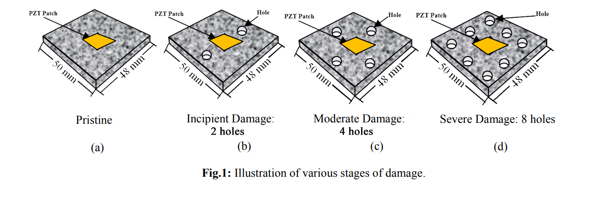
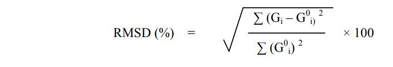

This experiment aims to teach the user, through a database of measured data, how occurrence of damage in a structure changes the conductance signature (EMI technique).
The test structure is an aluminium block (50 x 48 x 10 mm), having a surface bonded PZT patch (see Fig. 1a). To learn more about the EMI technique, click (<a href="http://ssdl.iitd.ac.in/vssdl/piezo.pdf" target="_blank">http://ssdl.iitd.ac.in/vssdl/piezo.pdf</a>).

**EXPERIMENTAL METHODOLOGY**

In this experiment, user gets an option of drilling multiple holes of 5 mm diameter in the host structure (aluminium block) to induce damage of three different severities in virtual mode:
1. Incipient Damage : 2 Holes (see Fig. 1b)
2. Moderate Damage : 4 Holes (see Fig. 1c)
3. Severe Damage : 8 Holes (see Fig. 1d)

The three damages are illustrated in Fig. 1
 

User has the facility to acquire signature of the structure in pristine as well as three damaged conditions. The signature acquisition is simulated to occur in same fashion as in the case of real experiment performed through LCR meter. You can acquire the signatures in this fashion for any damaged state and can download the signature as delimited data file. The data file for any condition has three columns: frequency (kHz), conductance (S) and susceptance (S). The user can compare the signature of any two stages for example: pristine and incipient damage, pristine and moderate damage and pristine and severe damage. Alternatively, the user can plot the signatures of all four states in a single graph and make observation as to how the signatures change with increase of damage severity.

To statistically quantify damage, compute root mean square deviation (RMSD) in conductance by following equation directly in MS excel:

<centerr>

Where

Gi0 = Baseline conductance value at <i>ith</i> frequency. 
Gi1 = Conductance value after a damage at <i>ith</i> frequency. 
<i>n</i> = No. of frequency data points 

As an exercise plot a histogram of RMSD for various damaged states. Describe your observation 

